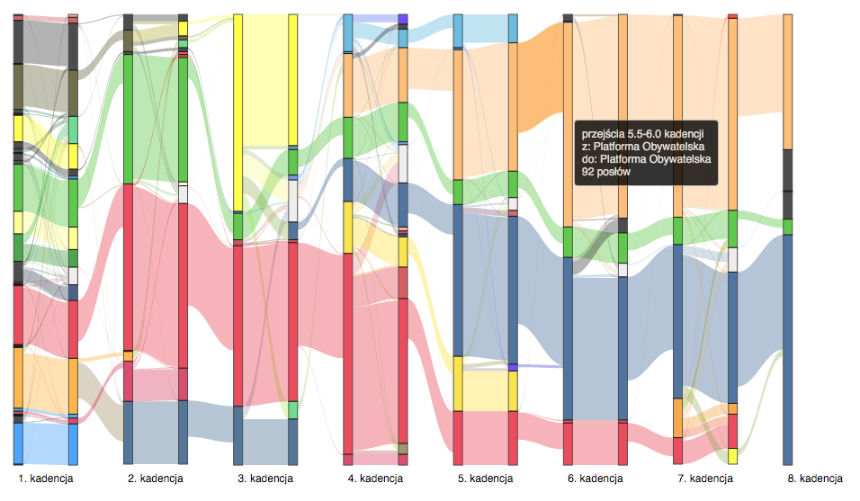

# 7 i pół kadencji polskiego sejmu - wizualizacja przepływów

Screenshot (`przeplywy.html`):

## Materiały

* https://pl.wikipedia.org/wiki/Pos%C5%82owie_na_Sejm_Rzeczypospolitej_Polskiej_I_kadencji
* do https://pl.wikipedia.org/wiki/Pos%C5%82owie_na_Sejm_Rzeczypospolitej_Polskiej_VIII_kadencji

(uwaga - zliczenia posłów wg partii na początku i na koniec bywają błędne, patrz poniżej!)

* http://www.sejm.gov.pl/archiwum/kluby/kadencja3/kluby_kola.htm
* http://www.sejm.gov.pl/archiwum/kluby/kadencja4/kluby_kola.htm
* http://www.sejm.gov.pl/archiwum/kluby/kadencja5/kluby_kola.htm

Kolory wg Wikipedii:

* https://pl.wikipedia.org/wiki/Szablon:Partie_polityczne_-_kolor
